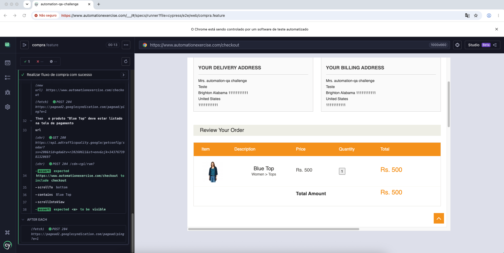
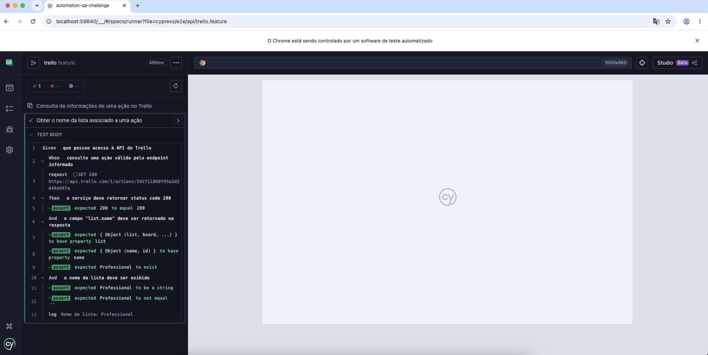

# QA Challenge - Cypress + Cucumber

## Objetivo

Implementar a automação dos cenários WEB e API utilizando Cypress, Cucumber e JavaScript, conforme especificado no desafio técnico.

---

## Tecnologias Utilizadas

* JavaScript
* Cypress
* Cucumber (BDD)
* Node.js

---

## Instalação

Clone o repositório:

```bash
git clone https://github.com/RoFalcao/automation-qa-challenge.git
```

Acesse a pasta do projeto:

```bash
cd automation-qa-challenge
```

Instale as dependências:

```bash
npm install
```

---

## Execução dos Testes

Executar via interface do Cypress:

```bash
npm run cy:open
```

Executar via terminal:

```bash
npm run cy:run
```

---

## Cenários WEB Automatizados

### Fluxo de compra com sucesso

**Objetivo:**
Validar que um usuário autenticado consegue pesquisar um produto, adicioná-lo ao carrinho e visualizar o item na etapa de checkout.

**Validações realizadas:**

* Login com credenciais válidas
* Pesquisa do produto "Blue Top"
* Inclusão do produto no carrinho
* Acesso ao carrinho de compras
* Acesso à tela de checkout
* Validação da exibição do produto na tela de pagamento

---

## Cenários API Automatizados

### Consulta de ação no Trello

**Endpoint:**

```http
GET https://api.trello.com/1/actions/592f11060f95a3d3d46a987a
```

**Validações realizadas:**

* Status Code 200
* Existência do campo `data.list.name`
* Validação do valor retornado: `Professional`
* Exibição do conteúdo solicitado pelo desafio

---

## Estrutura do Projeto

```text
automation-qa-challenge
│
├── cypress
│   ├── e2e
│   │   ├── api
│   │   │   └── trello.feature
│   │   └── web
│   │       └── compra.feature
│   │
│   └── support
│       ├── step_definitions
│       │   ├── compra.steps.js
│       │   └── trello.steps.js
│       │
│       └── e2e.js
│
├── evidencias
│   ├── api-trello-success.png
│   └── web-checkout-success.png
│
├── .gitignore
├── cypress.config.js
├── package.json
├── package-lock.json
└── README.md
```
---

## Evidências de Execução dos Testes

### WEB - Fluxo de Compra
**Comando utilizado**
npm run cy:open



### API - Consulta Trello
**Comando utilizado**
npm run cy:open



### Observações

As evidências apresentadas correspondem à execução bem-sucedida dos cenários automatizados WEB e API implementados para este desafio.


